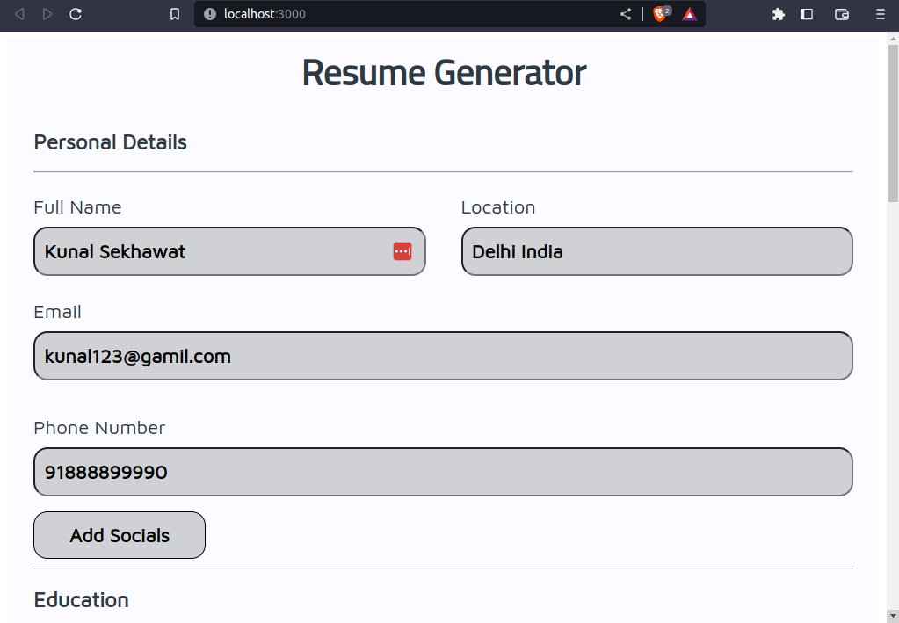
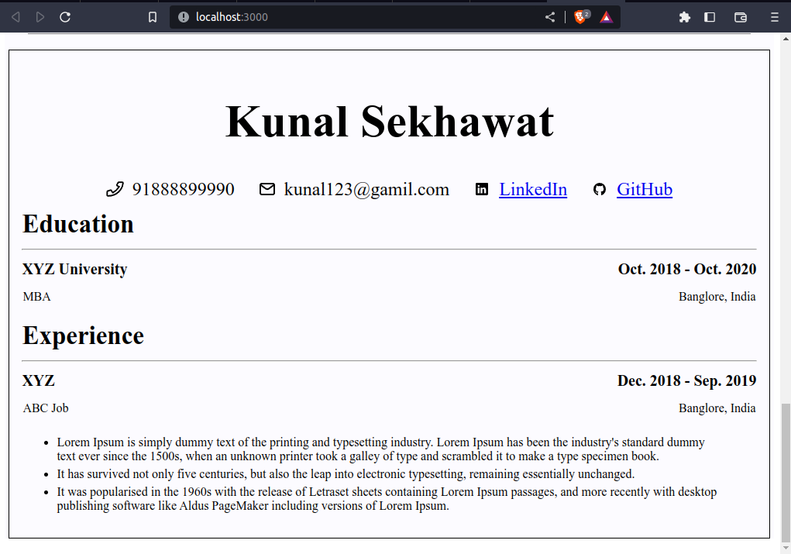

# Resume Generator
This is one of the projects of the odin project. The purpose is to practice the concepts of 
React framework like props, state, class components, handling states, etc.

# Features
- The user can enter their personal, education, and work experience details and 
the app will create a resume.
- Note: I did not add other sections of resume like skills, projects, etc. Because I
think I practiced the concepts of React which I need for this project. Also, It's a little time-consuming now, and I became a little lazy.

# What Did I learn
- I learned how to create a react app using create-react-app.
- How to make components using class-based components way.
- what are props and state and what is the difference between them.
- How to update the state without directly mutating.

# Project Video

# Getting Started with Create React App

This project was bootstrapped with [Create React App](https://github.com/facebook/create-react-app).

## Available Scripts

In the project directory, you can run:

### `npm start`

Runs the app in development mode.\
Open [http://localhost:3000](http://localhost:3000) to view it in your browser.

The page will reload when you make changes.\
You may also see any lint errors in the console.

### `npm run build`

Builds the app for production to the `build` folder.\
It correctly bundles React in production mode and optimizes the build for the best performance.

The build is minified and the filenames include the hashes.\
Your app is ready to be deployed!

See the section about [deployment](https://facebook.github.io/create-react-app/docs/deployment) for more information.
